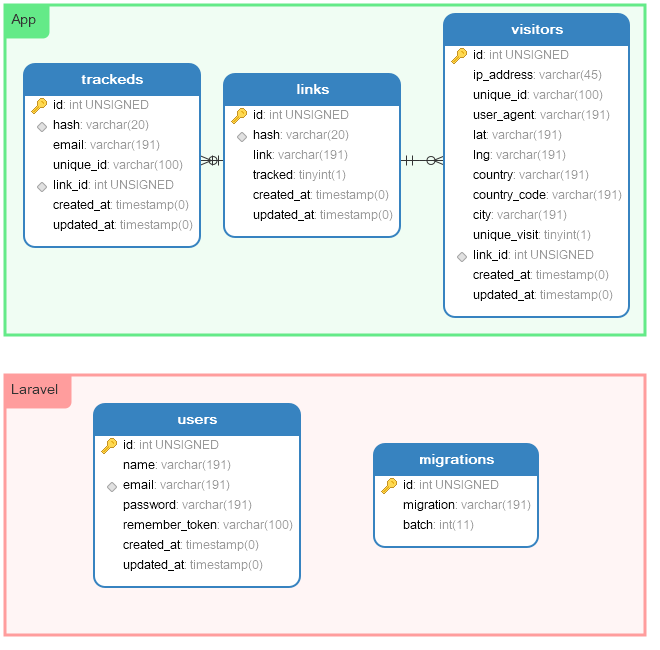
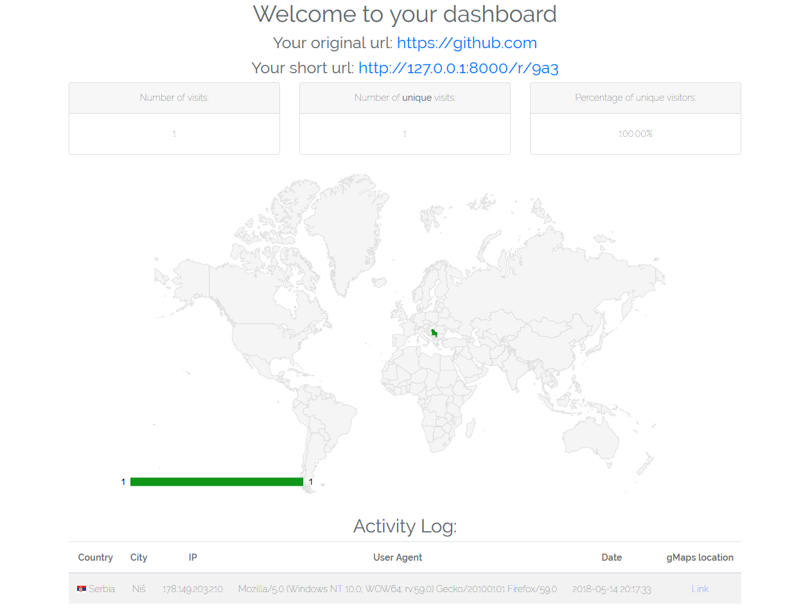

# LinkCutter


Framework: [Laravel 5.6](https://laravel.com/docs/5.6)

## Setup Development Environment

1. Clone repository.
2. Run `composer install` to install dependencies.
3. Create a copy of `.env.example` file, rename it to `.env` and input your own values.
4. Run `vendor\\bin\\homestead make` to generate Vagrantfile and Homestead.yaml configuration
    (see [Laravel Homestead](https://laravel.com/docs/5.6/homestead)).
5. Edit Homestead.yaml in order to setup project URL.
6. Run `vagrant up` to start virtual machine.
7. Run `vagrant ssh` to connect to virtual machine.
8. Go to `/vagrant` directory.
9. Run `php artisan storage:link` to create symbolic link in public folder, pointing to actual file storage folder.
10. Run `php artisan migrate` to create database tables.
11. Run `php artisan db:seed` to insert test data.
12. Run `php artisan key:generate` to generate random crypto key.
13. Run `php artisan passport:keys` to generate Passport crypto keys.

## Solution

First thing that needs to be considered is there are *three routes* that a user can take:

* Shortening an URL
* Visiting a short URL
* Visiting a dashboard link

Each of these routes need a separate logic based on if user already visited etc...

### Shortening URL

On the index (shortening) page there are two inputs where one is **hidden** under a collapse. The two inputs are:

* URL input
* Email input

For both input there is a front-end validation that are `onkeydown` and `copy/paste` this is for UX reasons (so that a user would have a feedback). Also there is a back-end validation because we shouldn't trust JS.

Based on the `email` input there are two cases.

**If email is empty:** In this case link is not tracked so just add it to `links` table.

**If email is filled:** In this case link should be tracked, add it to `links` table, add the email and dashboard hash to `tacked` table. Further more generate a unique id (`session_id`) and add it to a `SID` cookie.

### Visiting a short URL

When a user visits a short link `/r/{hash}` , a database lookup will be done. Based on what the query returns there are two cases:

**Hash not found:** If the `hash` provided in the URL is not in the database redirect the user to homepage.

**Hash is found:** If the `hash` provided in the URL is in the database this will draw two more cases:

​		**Hash not tracked:** If the found `hash` has the field `tracked` set to `0` this means that the visits shouldn't be logged, so get the `link` field and redirect the user to endpoint.

​		**Has is tracked:** If the found `hash` has the field `tracked` set to `1` this means that the visits MUST be logged. Check if a user has visited (more on this later), log the visit to `visitors` table, get the `link` field and redirect the user to endpoint.

### Visiting a dashboard link

When a user visits a dashboard link `/d/{hash}`, a database lookup will be done. Base on the what the query returns there are two cases:

**Hash not found:** If the `hash` provided in the URL is not in the database redirect the user to homepage.

**Hash is found:** Simply show all the data. This can be improved in a way where we check if the user has the `SID` cookie if he has, we check if it matches with the one for that link in the database. Based on this we either show the dashboard or request the user to enter the original email he user for the link. Now we can either verify if the entered email matches with the original one or send a simple pin code and wait for the user to enter the pin code and regenerate his `SID`.

## URL shortening algorithm

The algorithm for generating the URL is really simple and fast. Also it provides around `113 379 904`[^1] possible combinations. Here is how the hash is generated:

```php
substr(hash('sha512', $url . self::SALT . $random), 0, rand(3, 6));
```

We take the original URL, add a salt to it and get the `SHA512` hash, from that we take the first three to six characters.

To prevent possible collisions we have a simple function which will add a random number to the URL and salt:

```php
$code = self::generateHash($url);

while (self::checkForHashCollision($code)) {
	$code = self::generateHash($url, rand());
}
```

 *Please note that I am aware that`rand()` function is predictable and it isn't cryptographically secure pseudorandom number generator (CSPRNG ) but I choose it because it's **fast**, were `random_int` is CSPRNG but slow.*

## Database

Database is really simple, it only has three tables, here is a quick breakdown of the structure:

* **visitors** - User visits (log)
* **links** - Short links table
* **trackeds** - Links that are tracked get a generated hash for the database and the user email get stored in this table.

**Image:**



## Unique visit?

What is a unique visit? This is a paradox question because is a user unique if he visits the link from the same computer but a different browser, or is a visit unique only based on the IP? My limited time led me to a simple and *mostly* effective solution:

If you remember when a user cuts the URL  we add a unique cookie `SID` now we check if a user has a `SID` cookie if so we cross reference it in the database and check in the `visitors` table whether that ID has visited the given `hash` if it hasn't add his IP, SID to `visitors` table and **set `unique` field to `1`**.

If a user doesn't have a cookie that means he never created nor visited a shortened URL or he deleted his cookies therefore we check if his IP address **AND** his user agent are in the database. If so add his IP, SID to `visitors` table and **set `unique` field to `0`** and update his `SID` to the one from the database.

From the above you can see that a visitor is not unique if he has the same IP address **and** user agent (*note that the user agent info is not only the browser name it contains the version and more `<product> / <product-version> <comment>` making this more unique to a user*).

## Screenshots 




[^1]: `SHA512` has a character pool of 22  characters `[a-fA-F0-9]` and a maximal link length is six  characters so this is 22^6

Author: [Marko](https://ilic.ninja), 2018.
