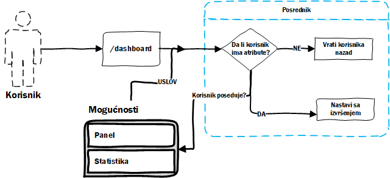

# Mogućnosti

Mogućnosti su *opcije* koje korisnik ima u zavisnosti od pretplate. Neke od inicijalnih opcija sa kojima dolazi projekat:

* **Praćenje** - mogućnost da se prati statistika linka.
* **Panel** - pristup korisničkom panelu.
* **Jedinstvene posete** - praćenje jedinstvenih korisnika.
* **Lokacija** - praćenje sa koje lokacije je pristupljeno hešu.
* **VPN detektor** - praćenje da li je poseta sa VPN adrese ili ne.
* **Naziv linka** - mogućnost da se unese heš po želji.

Opcije je moguće dinamički dodavati, brisati i isto tako ih vezivati za određene pretplate.

## Kontrola pristupa

Pošto je opcija vezana za pretplatu, mora se ograničiti da korisnik svojom pretplatom ima samo opcije svoje pretplate. Što znači ako korisnik nema opciju **panel** on neće moći da pristupi panelu.

Ovaj problem je rešen korišćenjem posrednika (middleware-a). Uveden je `FeatureMiddleware` posrednik, koji je zadužen da proveri da li korisnik ima *mogućnosti* koje su prenete preko rutera.



### Ruter

Način na koji se ograničava pristup rutama je pomoću atributa grupe u ruteru.

```php
Route::group(['features' => ['dashboard']], function() {
	Route::get('/dashboard', 'DashboardController@index')
});
```

Preko atributa `features` prenosi se slug mogućnosti za koje se želi da se ograniči groupa ruta.

Prilikom prisupa nekoj od ruta iz grupe naš posrednik će proveriti da li korisnik ima **SVE** mogućnosti koje zahteva ta grupa.

### Sve mogućnosti korisnika

Kako bi se vršila provera da li korisnik ima neku od *mogućnosti* mora se stalno imati uvid u njegove mogućnosti. Ovde nastaje problem, ako uzimamo mogućnosti kad god proveravamo da li on ima tu mogućnost dolazimo do **N+1**[^1] problem.

Ovaj problem je rešen korišćenjem `Eager loading`[^2] tehnike u laravelu, gde se prilikom vraćanja korisnika vraća njegova pretplata i svi njegovi atributi.

[^1]: Čest problem koji se javlja kada pomoću jedno upita vratimo kolekciju i onda prođemo kroz tu kolekciju gde za svaku stavku izvućemo dodatne stvari.
[^2]: https://laravel.com/docs/5.6/eloquent-relationships#eager-loading