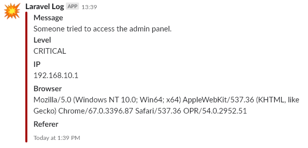
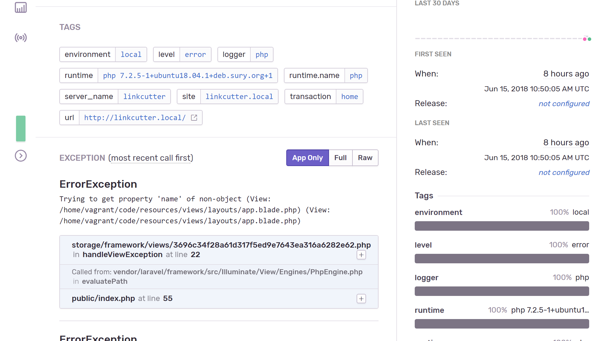

# Logovanje

Prilikom izrade veb aplikacije vrlo je važno pratiti potencijalne greške,a kako se ovde koristi Laravel okruženje, logavanje se vrši automatski za svaki vid greške.

Log fajl se nalazi u: `storage\logs\laravel.log`

Laravel je podešen da radi logovanje na više kanala:

* Single - Njegov standardni log,
* Slack

## Slack

Slack je podešen da prijavljuje greške čiji je minimalni nivo važnosti **critical**.

Ovo je moguće promeniti u konfiguraciji za logovanje: `config\logging.php`

Trenutno kako je podešen slack je:

```php
'slack' => [
    'driver' => 'slack',
    'url' => env('LOG_SLACK_WEBHOOK_URL'),
    'username' => 'LinkCutter Log',
    'emoji' => ':boom:',
    'level' => 'critical', // Minimalni nivo
],
```


> Status greške je određen po **RFC 5424** specifikaciji.
>
> https://tools.ietf.org/html/rfc5424
>
> Greške po važnosti:
>
> ```
> Numerical         Severity
> Code
> 
> 0       Emergency: system is unusable
> 1       Alert: action must be taken immediately
> 2       Critical: critical conditions
> 3       Error: error conditions
> 4       Warning: warning conditions
> 5       Notice: normal but significant condition
> 6       Informational: informational messages
> 7       Debug: debug-level messages
> ```

Način na koji laravel obaveštava slack je pomoću webhook-a koji je podešen u Slack-u.

https://api.slack.com/incoming-webhooks

Kad se napravi hook potrebno je iskopirati URL do hook-a i dodati ga u `.env` fajlu kao `LOG_SLACK_WEBHOOK_URL` opcija.

### Laravel logovanje

Način na koji možemo da logujemo grešku je preko Log fasade:

```php
Log::emergency($message);
Log::alert($message);
Log::critical($message); // Odavde pa na gore se loguje u slack-u
Log::error($message);
Log::warning($message);
Log::notice($message);
Log::info($message);
Log::debug($message);
```

Recimo da želimo da obavestimo administratora da neko želi da pristupi admin sistemu a za to nema odgovarajuće permisije. To je moguće uraditi u posredniku (middleware-u) koji proverava da li korisnik ima permisije i  obaveštava administratora.

```php
Log::critical('Someone tried to access the admin panel.', [
    'IP'        => $request->ip(),
    'Browser'   => $request->server('HTTP_USER_AGENT'),
    'Referer'  =>$request->server('HTTP_REFERER'),
]);
```

Kako to izgleda kad administrator primi poruku:



## Sentry

Kao dodatni i profesinalniji način logovanja koristi se [Sentry](https://sentry.io). Sentry obuhvata obradu izuzetaka koji se šalju Sentry-u na obradu.



Svaka greška koja se desi, Sentry pretvara u task koji može da se dodeli nekom od članova tima. Na taj način svaki izuzetak biva rešen.

Obaveštenje se takođe šalje na mail.