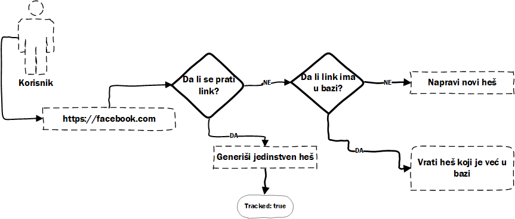

# Korisnici

Projekat sadrži tri vrste koristinka: admin, korisnik i gost. U nastavku teksta biće opisan svaki od tipova korisnika.

## Gost

Svaki korisnik koji pristupi sajtu je gost i on ima pristup samo početnoj strani. Gost može da skrati link ali prilikom skraćivanja linka nema mogućnost statistike, takođe, gostu nije zagarantovan **jedinstven** heš.

Kada gost pošalje zahtev za skraćivanje linka, u bazi se uradi provera da li taj link već postoji. Ako taj link postoji vraća se postojeći heš, u suprotnom se generiše novi heš.

Ovo je iz razloga što nije bitno da li gost ima jedinstven heš ili ne, sve dok ga taj heš vodi na željeni link jer opcija praćenja ne postoji.

## Korisnik

Registrovani korisnik ima mogućnost da se pretplati na neki od paketa, kao i mogućnost da skrati link koji ne želi da prati i koji, kao u slučaju gosta, ne mora biti jedinstven. Sa druge strane, korisnik ima mogućnost da prati statistiku skraćenog linka ako to odabere.

Opcije korisnika je moguće dinamički proširiti pomoću raznih [opcija](Features.md) koje korisnik dobija kada se prijavi na neki od planova za [pretplatu](Subscription.md).

## Administrator

Administrator ima iste opcije kao korisnik, a uz to ima i pristup admin panelu.

