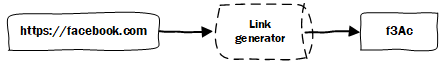

# Solution

The way the system works is nothing new, it is simple. Take the original URL, generate a *hash*. When someone opens the
hash redirect the user to the original URL. Simple put a [Hash table (hash map)](https://en.wikipedia.org/wiki/Hash_table).




**Link generator** must have the least possible collisions and also have an option for the same input to return a unique
value. This will be needed for tracking purpose, because we don't want to hash `facebook.com` the same way for each user.

*While writing this generator I turned my attention to speed, as this problem can be solved in multiple ways.*

## Slow and Safe Generator

This generator hashes the URL with a help of a cryptographically secure random generator ([CSPRNG](https://en.wikipedia.org/wiki/Cryptographically_secure_pseudorandom_number_generator)).
In PHP this function is called `random_int()` and it is implemented differently on each operating system.

There is a bih drawback to this function, it is **noticeably** slow.

## Fast and Unsafe Generator

On the other hand, if we use a function that is not *CSPRNG* like `rand()` we can speedup the generator a lot.
Unfortunately, `rand()` is really not that random and as stated on the PHP's [documentation](http://php.net/manual/en/function.rand.php).

> **Caution**
This function does not generate cryptographically secure values, and should not be used for cryptographic purposes.
If you need a cryptographically secure value, consider using `random_int()`, `random_bytes()`, or `openssl_random_pseudo_bytes()` instead.


## Fast and Safe Generator

If we look at the quote from the above, currently in PHP version *7.2.6* there are three CSPRNG functions. I already
tried one of the functions `random_int()` and wasn't satisfied with the performance, so I gave `random_bytes()` a go.

I wasn't really surprised when I concluded it is fast, even faster then `rand()`. Simple because it works on a low level, with bytes. 


> Note: Function `random_bytes() `comes with PHP 7.0 and above.

## Banchmark

To test my theory I wrote a simple PHP script to compare `rand` and `random_bytes`. 


| Cycles                 | `random_bytes`  | `rand`          |
| ---------------------- | --------------- | --------------- |
| Cycle 1                | 1.7273991107941 | 5.7265629768372 |
| Cycle 2                | 1.8290400505066 | 5.5975389480591 |
| Cycle 3                | 1.7188358306885 | 5.4669740200043 |
| Cycle 4                | 1.8076210021973 | 5.666111946106  |
| Cycle 5                | 1.796245098114  | 5.5624511241913 |
| Cycle 6                | 1.8754560947418 | 5.5897090435028 |
| Cycle 7                | 1.6866478919983 | 5.5180299282074 |
| Cycle 8                | 1.7576761245728 | 5.5145440101624 |
| Cycle 9                | 1.7203500270844 | 5.5683920383453 |
| Cycle 10               | 1.682667016983  | 5.5527658462524 |

**Number of hashes per cycle:**  `1 000 000`

## Solution

First thing that needs to be considered is there are *three routes* that a user can take:

* Shortening an URL
* Visiting a short URL
* Visiting a dashboard link

Each of these routes need a separate logic based on if user already visited etc...

### Shortening URL

On the index (shortening) page there are two inputs where one is **hidden** under a collapse. The two inputs are:

* URL input
* Email input

For both input there is a front-end validation that are `onkeydown` and `copy/paste` this is for UX reasons (so that a user would have a feedback). Also there is a back-end validation because we shouldn't trust JS.

Based on the `email` input there are two cases.

**If email is empty:** In this case link is not tracked so just add it to `links` table.

**If email is filled:** In this case link should be tracked, add it to `links` table, add the email and dashboard hash to `tacked` table. Further more generate a unique id (`session_id`) and add it to a `SID` cookie.

### Visiting a short URL

When a user visits a short link `/r/{hash}` , a database lookup will be done. Based on what the query returns there are two cases:

**Hash not found:** If the `hash` provided in the URL is not in the database redirect the user to homepage.

**Hash is found:** If the `hash` provided in the URL is in the database this will draw two more cases:

​		**Hash not tracked:** If the found `hash` has the field `tracked` set to `0` this means that the visits shouldn't be logged, so get the `link` field and redirect the user to endpoint.

​		**Has is tracked:** If the found `hash` has the field `tracked` set to `1` this means that the visits MUST be logged. Check if a user has visited (more on this later), log the visit to `visitors` table, get the `link` field and redirect the user to endpoint.

### Visiting a dashboard link

When a user visits a dashboard link `/d/{hash}`, a database lookup will be done. Base on the what the query returns there are two cases:

**Hash not found:** If the `hash` provided in the URL is not in the database redirect the user to homepage.

**Hash is found:** Simply show all the data. This can be improved in a way where we check if the user has the `SID` cookie if he has, we check if it matches with the one for that link in the database. Based on this we either show the dashboard or request the user to enter the original email he user for the link. Now we can either verify if the entered email matches with the original one or send a simple pin code and wait for the user to enter the pin code and regenerate his `SID`.

## URL shortening algorithm

The algorithm for generating the URL is really simple and fast. Also it provides around `113 379 904`[^1] possible combinations. Here is how the hash is generated:

```php
substr(hash('sha512', $url . self::SALT . $random), 0, rand(3, 6));
```

We take the original URL, add a salt to it and get the `SHA512` hash, from that we take the first three to six characters.

To prevent possible collisions we have a simple function which will add a random number to the URL and salt:

```php
$code = self::generateHash($url);

while (self::checkForHashCollision($code)) {
	$code = self::generateHash($url, rand());
}
```

 *Please note that I am aware that`rand()` function is predictable and it isn't cryptographically secure pseudorandom number generator (CSPRNG ) but I choose it because it's **fast**, were `random_int` is CSPRNG but slow.*

## Database

Database is really simple, it only has three tables, here is a quick breakdown of the structure:

* **visitors** - User visits (log)
* **links** - Short links table
* **trackeds** - Links that are tracked get a generated hash for the database and the user email get stored in this table.

**Image:**


