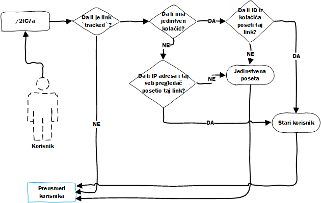

# Posete

Kako je jedna od ideja projekta mogućnost praćenja statistike svakog linka, potrebno je da se svaka poseta (preusmeravanje) prati. Kada korisnik poseti neki heš pre nego što ga aplikacija preusmeri na prvobitni link čuvaju se sledeće vrednosti:

* Tip veb pretraživača.
* IP adresa.
* Lokacija (na osnovu IP adrese)
  * Tačna lokacija (geografska širina i dužina).
  * Grad.
  * Država.
* Da li je IP adresa sa VPN-a.
* Odakle je došao korisnik.

Sa ovim atributima dobija se prilično bogata statistika koja može da da korisniku vrlo jasnu sliku odakle dolaze koju su posetili link.

Jedna vrlo interesanta mogućnost aplikacije je praćenje jedinstvenih poseta, naravno tu je i paradoks, šta se računa kao jedinstvena poseta?

## Jedinstvena poseta

Ne postoji unikatno niti "najbolje" rešenje za određivanje jedinstvene posete ali je u ovom slučaju odlučeno da se prati IP adresa i veb pretraživač koji korisnik koristi.

Kada korisnik pristupi hešu, prva provera je da li se taj heš uopšte prati, ako se ne prati može odmah da se preusmeri korisnik na prvobitni link. Ako se heš prati, mora se proveriti da li u kolačićima postoji identifikacioni broj sesije (jedinstven za svakog posetioca sajta). Ako postoji kolačić, proverimo da li se link id i id sesije poklapaju. Ako se vrednosti poklope znači da je taj korsnik već posetio link što znači da link **nije** jedinstven. U suprotnom znači da je link jedinstven.

> Svaki korisnik koji dođe bez kolačića dobiće jedinstveni kolačić koji se koristi za praćenje kao što je gore opisano.

Dodatna provera koja postoji jeste da se proveri da li je korisnik sa IP adresom **i** tim veb pregledačem već posetio link. Ako nije onda je poseta jedinstvena.

> Prilikom pamćenja veb pretraživača, ne pamti se samo tip, već verzija i sistem, što ovakav način određivanja jedinstvenosti čini preciznijim.